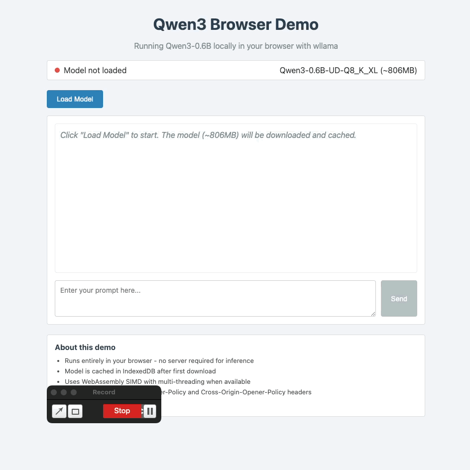

# Qwen3 Browser LLM

Run the Qwen3-0.6B language model directly in your browser using WebAssembly. This project demonstrates client-side LLM inference without any server-side processing.



## Overview

This project provides two implementations for running Qwen3 locally:

1. **Browser Demo** - A standalone web page that loads and runs the model
2. **Chrome Extension** - A Manifest V3 extension with popup interface

Both implementations use [wllama](https://github.com/ngxson/wllama), a WebAssembly port of [llama.cpp](https://github.com/ggerganov/llama.cpp), to run inference entirely in the browser.

## Features

- Client-side inference with no server required
- Multi-threaded WebAssembly for improved performance
- Model caching in IndexedDB for faster subsequent loads
- Streaming token generation with real-time UI updates
- Progress tracking during model download

## Requirements

- Modern browser with WebAssembly support
- SharedArrayBuffer support (requires COOP/COEP headers)
- Approximately 1GB of available memory
- The Qwen3-0.6B GGUF model file (~806MB)

## Project Structure

```
.
├── qwen3-browser-demo/     # Standalone browser demo
│   ├── index.html          # Main demo page
│   ├── server.js           # Development server with COOP/COEP headers
│   ├── dev.sh              # Development utilities script
│   ├── wllama/             # wllama WASM binaries and JavaScript
│   └── models/             # GGUF model files (not included)
│
├── extension/              # Chrome extension
│   ├── manifest.json       # Extension manifest (MV3)
│   ├── js/
│   │   ├── background.js   # Service worker message broker
│   │   ├── offscreen.js    # Offscreen document for WASM worker
│   │   ├── popup.js        # Popup UI controller
│   │   └── wllama/         # wllama WASM binaries
│   ├── html/               # HTML pages
│   └── models/             # GGUF model files (not included)
│
└── docs/                   # Documentation and screenshots
```

## Quick Start

### Browser Demo

1. Download the Qwen3-0.6B GGUF model:
   ```bash
   # Create models directory
   mkdir -p qwen3-browser-demo/models

   # Download from Hugging Face
   # https://huggingface.co/unsloth/Qwen3-0.6B-GGUF
   # Place the file as: qwen3-browser-demo/models/Qwen3-0.6B-UD-Q8_K_XL.gguf
   ```

2. Start the development server:
   ```bash
   cd qwen3-browser-demo
   node server.js
   ```

3. Open http://localhost:8080 in your browser

4. Click "Load Model" and wait for the download to complete

5. Enter a prompt and click "Send"

### Chrome Extension

1. Download the model file to `extension/models/Qwen3-0.6B-UD-Q8_K_XL.gguf`

2. Load the extension in Chrome:
   - Navigate to `chrome://extensions`
   - Enable "Developer mode"
   - Click "Load unpacked"
   - Select the `extension` directory

3. Click the extension icon and use the popup interface

## Development

### Using dev.sh

The browser demo includes a development script with common commands:

```bash
cd qwen3-browser-demo

# Start the development server
./dev.sh start

# Kill any process on port 8080
./dev.sh kill

# Check if model file exists
./dev.sh model

# Clean and reinstall dependencies
./dev.sh clean

# Show help
./dev.sh help
```

### Server Requirements

The development server must set these HTTP headers for SharedArrayBuffer to work:

```
Cross-Origin-Opener-Policy: same-origin
Cross-Origin-Embedder-Policy: require-corp
```

The included `server.js` sets these headers automatically.

## Technical Details

### Architecture

The browser demo uses a simple architecture:
- Main thread handles UI and user interaction
- wllama manages a Web Worker for WASM execution
- Model weights are cached in IndexedDB after first download

The Chrome extension uses a more complex architecture due to MV3 restrictions:
- Service worker (background.js) handles message routing
- Offscreen document hosts the wllama Web Worker
- Popup UI communicates via chrome.runtime messaging

### Model Format

This project uses GGUF (GPT-Generated Unified Format) model files. The recommended model is:

- **Model**: Qwen3-0.6B-UD-Q8_K_XL
- **Size**: ~806MB
- **Quantization**: Q8_K_XL (8-bit)
- **Source**: [Hugging Face](https://huggingface.co/unsloth/Qwen3-0.6B-GGUF)

### Performance Considerations

- First load downloads the full model (~806MB)
- Subsequent loads use the IndexedDB cache
- Multi-threading requires SharedArrayBuffer (COOP/COEP headers)
- Single-threaded fallback is available for incompatible environments
- Inference speed depends on device CPU capabilities

## Dependencies

- [wllama](https://github.com/ngxson/wllama) - WebAssembly bindings for llama.cpp
- [llama.cpp](https://github.com/ggerganov/llama.cpp) - C++ LLM inference library

## References

- [wllama Documentation](https://github.ngxson.com/wllama/docs/)
- [llama.cpp Repository](https://github.com/ggerganov/llama.cpp)
- [Qwen3 Models](https://huggingface.co/Qwen)
- [Chrome Extensions MV3](https://developer.chrome.com/docs/extensions/develop/migrate/what-is-mv3)
- [Cross-Origin Isolation Guide](https://web.dev/cross-origin-isolation-guide/)

## License

MIT License
